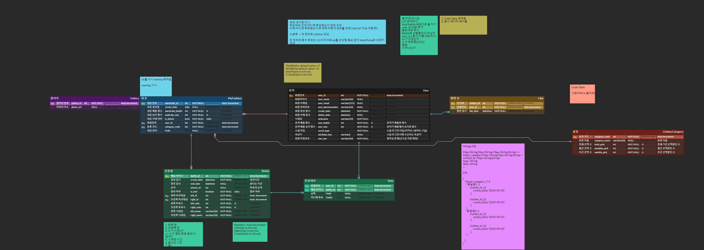

## 오늘의 옷 : O-OTd 📝

## *"OOTD"는 당신의 패션 여정을 함께합니다. 언제 어디서나 손쉽게 스타일을 탐색하고, 새로운 자신을 발견해보세요."*

## 목차
1. [기획 의도 및 기대 효과](#1-기획-의도-및-기대-효과)
2. [개발 환경](#2-개발-환경)
3. [주요 기능](#3-주요-기능)
4. [기술 소개](#4-기술-소개)
5. [설계 문서](#5-설계-문서)
6. [팀원 소개](#6-팀원-소개)

## 1. 기획 의도 및 기대 효과
패션은 현대 사회에서 개인의 개성을 표현하는 중요한 요소입니다. 하지만 모든 사람이 자신의 스타일을 잘 이해하거나 찾기 쉬운 것은 아닙니다. 많은 사람들이 스타일리스트의 조언을 받기 어렵고, 직접 입어보며 비교할 옷이 없어서 원하는 스타일을 찾기 어려운 상황에 직면하거나, 사진만으로 스타일을 파악하기 힘든 상황에 직면합니다.

이러한 어려움을 해결하기 위해, 저희는 남성들이 자신만의 스타일을 손쉽게 찾고, 새로운 스타일을 발견할 수 있도록 돕는 패션 추천 및 참고 서비스, "O-OTd"를 기획했습니다. "O-OTd"는 사용자가 원하는 스타일을 쉽게 탐색하고, 이를 기반으로 유사한 스타일을 추천하여 자연스럽게 새로운 패션에 도전할 수 있는 기회를 제공합니다.

이 서비스를 통해 사용자는 언제 어디서나 자신의 개성을 표현할 수 있는 스타일을 쉽게 발견하고, 자신의 취향에 맞는 패션을 더 효과적으로 탐색할 수 있습니다. 궁극적으로는 더 많은 남성들이 자신감을 가지고 패션을 즐기며, 개성을 표현할 수 있는 환경을 만들고자 합니다.

## 2. 개발 환경
### Frontend
| Name | Version |
| --- | --- |
| Typescript | 5.0.4 |
| React-native | 0.75.2 |
| Openjdk | 17.0.12 |
| NodeJs | 20.15.0 |
| Axios | 1.7.7 |
| Zustand | 4.5.5 |

### Backend
| Name | Version |
| --- | --- |
| Java | 17 |
| Spring Boot | 3.3.4 |
| Spring Cloud | 4.1.2 |
| Eureka | 2.0.2 |
| MySql | 8.0 |
| Redis | 7.4.0 |

### Infra
| Name | Version |
| --- | --- |
| Docker | 27.2.1 |
| Docker Compose | 2.29.2 |
| Nginx | 1.27.0 |
| Kafka | 2.8.1|
|zookeeper | 3.4.13 |

### CI/CD
| Name | Version |
| --- | --- |
| Jenkins | 2.475|

## 3. 주요 기능
### 소셜 로그인 기능

### AI Style Maker

### AI LENS

### Beyond U

## 4. 기술 소개

1. **ImageFusion API**
    - **서비스 이름**: 이미지 세부 분류 및 벡터 생성 API
    - **사용 목적**: YOLO 모델을 사용하여 특정 클래스를 감지한 후, 감지된 정보를 기반으로 6차원 벡터를 생성하여 외부 클러스터 예측 서버로 전송
    - **사용 방법**: 
        - 엔드포인트: /process_images 프로젝트 생성.
        - 메소드: POST
        - 요청 헤더: Content-Type: application/json
        - 요청 바디: { "image_urls": [ "https://example.com/path/to/main_image.jpg", "https://example.com/path/to/sub_image.jpg" ] }
•    활용 방법:
    - **활용 방법**: 
        - 이미지 데이터에 대한 모델 예측 수행
        - 벡터 생성 및 결합
        - 외부 서버로 전송
    - **사전 요구사항**
        - YOLO 모델 파일: best.pt 파일이 프로젝트 디렉토리에 위치
        - 외부 서버 접근성: 외부 클러스터 예측 서버가 정상 작동 및 접근 가능 여부 확인 요망

2. **ImageClustering API**
    - **서비스 이름**: AI 기반 클러스터링 및 이미지 번호 리턴 API
    - **사용 목적**: YOLO 모델을 사용하여 특정 클래스가 감지된 정보를 받으면, K-Means or Spectral Clustering 후, 20개의 이미지 번호를 리턴함
    - **사용 방법**: 
        - /predict
        - 메소드: POST
        - 요청 헤더: Content-Type: application/json
        - 요청바디: {
  "point": [float, float, float, float, float, float]
}       
    - 응답:
[15999, 34784, 12127, 92, 81, 123, 25, 4831, 67, 9999, 23, 56, 89, 12, 121265, 41, 22219, 112736, 50, 189977]
    - **활용 방법**: 
        - AI 서버에서 생성된 벡터를 바탕으로 유사한 이미지 번호 제공
    - **사전 요구사항**
        - Cluster 디렉토리 및 파일: save_clustering.py를 통해 생성된 cluster_data 디렉토리와 내부에 데이터 파일들이 위치

3. **카카오 소셜 로그인**
    - **서비스 이름**: Kakao Social Login (카카오 소셜 로그인)
    - **사용 목적**: 사용자들이 카카오 계정을 사용해 손쉽게 로그인할 수 있도록 함
    - **가입 절차**:
        - Kakao Developers에서 계정 생성 후 애플리케이션 등록.
        - '카카오 로그인' 기능을 활성화하고 Redirect URI 설정.
        - JavaScript 키 및 REST API 키 발급.
    - **API KEY**:
        - JavaScript 키: (보안상 API 키는 별도 관리)
        - REST API 키: (보안상 API 키는 별도 관리)
    - **활용 방법**:
        - 프론트엔드에서 JavaScript SDK를 사용해 로그인 버튼 구현.
        - 사용자가 카카오 계정으로 로그인 시, 서버 측에서 REST API를 활용해 사용자 정보 조회.

4. **MSA Spring Boot 및 Spring Cloud**
    - **사용 목적**: 마이크로서비스 아키텍처(MSA)를 기반으로 분산 시스템을 구축하여 각 서비스의 독립성과 유연성을 증대시키기 위함.
    - **사용 방법**:
        - Spring Boot: 각 마이크로서비스는 독립적인 Spring Boot 애플리케이션으로 개발되며, RESTful API를 통해 서로 통신.
        - Spring Cloud:
            - 서비스 디스커버리: Netflix Eureka로 각 서비스가 중앙 레지스트리에서 자신을 등록하고 다른 서비스를 발견할 수 있게 함.
            - Spring Cloud Gateway를 사용해 클라이언트 요청을 적절한 서비스로 라우팅하고 검증하는 역할을 수행.
    - **활용 방법**:
        - 서비스 분리와 독립적 배포: 
            - 각 비즈니스 도메인에 맞게 서비스를 분리하고, 독립적으로 개발 및 배포 가능.
        - 확장성 있는 시스템 구축:
            - 트래픽 증가에 따라 특정 서비스만 개별적으로 확장 가능.
        - API Gateway를 통한 요청 관리:
            - 클라이언트 요청을 통합적으로 관리하여 인증/인가, 로깅, 모니터링 등 부가적인 기능을 일관되게 처리.

## 5. 설계 문서

### 와이어 프레임 Web

### 시스템 아키텍쳐

### ERD

### 요구사항 정의서

### API명세서

## 6. 팀원 소개

| **[최동호](https://www.notion.so/11862c55ad6b80ad978cc65705da578b)** | **[김동현](https://www.notion.so/11862c55ad6b80b2aa7fe51218f6eb92)** | **[손우혁](https://www.notion.so/11862c55ad6b80b1a0e8fc9d079eda13)** | **[오성혁](https://www.notion.so/11862c55ad6b808e9f12c3b4e60249f7)** | **[정범수](https://www.notion.so/11862c55ad6b804c81a4de7099071bc7)** | **[조성인](https://www.notion.so/11862c55ad6b80f1b461fccd105eec59)** |
|:---:|:---:|:---:|:---:|:---:|:---:|
|  |  |  |  |  |  |
| Backend | AI | Data | Infra/Backend | Frontend | Frontend |

**Backend**
- 최동호 : 팀장 / 회원 및 인증 관련(OAuth, JWT) 유저, Beyond U API 개발 
**Frontend**
- 정범수 : 웹/앱 전체적인 UI/UX 구현 / 화상 회의 관리 API 연동 / WebRTC 기반 환경 세팅 및 STT 데이터, 실시간 통신 처리
- 조성인 : 프로젝트 기획 / 목업(피그마) 제작 / 시스템 아키텍쳐 등 산출물 제작 /유저 관리 및 인증(JWT, Oauth) 관련 api 연동 / 발표 자료 제작

**AI**
- 김동현

**BigData**
- 손우혁
**Infra**
- 오성혁 : 개발환경 구축(프론트엔드&백엔드 도커 설정) / 배포환경 구축 / CI/CD자동배포-젠킨스 / 수동배포-쉘코드 / 포팅매뉴얼 및 기타 산출물 관리
