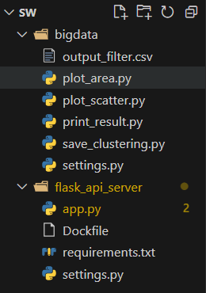

# 1. 포팅 메뉴얼(서버1)

## 1. 사용 도구

---

- 이슈 관리: **Jira**
- 형상 관리: **GitLab**
- 커뮤니케이션: **Notion, MatterMost**
- 디자인: **Figma**
- CI/CD: **Jenkins**

## 2. 개발 도구

---

### Frontend

### Backend

- **Visual Studio Code 1.90.2**

- **Intellij 2024.2.3 (Ultimate Edition)**

## 3. 폴더 구조

---

- 전체 폴더 구조

  

- Backend

  - Eureka
    

  - API-Gateway
    

  - User
    

  - Gallery
    

  - Battle
    

  - Common-Library
    

- Frontend-Web
  
- Nginx(Reverse-proxy)

- Docker-compose

- Shellcode

## 4. 개발 환경 : Version

---

### Frontend

| Name         | Version |
| ------------ | ------- |
| Typescript   | 5.0.4   |
| React-native | 0.75.2  |
| Openjdk      | 17.0.12 |
| NodeJs       | 20.15.0 |
| Axios        | 1.7.7   |
| Zustand      | 4.5.5   |

### Backend

| Name         | Version |
| ------------ | ------- |
| Java         | 17      |
| Spring Boot  | 3.3.4   |
| Spring Cloud | 4.1.2   |
| Eureka       | 2.0.2   |
| MySql        | 8.0     |
| Redis        | 7.4.0   |

### Infra

| Name           | Version |
| -------------- | ------- |
| Docker         | 27.2.1  |
| Docker Compose | 2.29.2  |
| Nginx          | 1.27.0  |
| Kafka          | 2.8.1   |
| zookeeper      | 3.4.13  |

### CI/CD

| Name    | Version |
| ------- | ------- |
| Jenkins | 2.475   |

## 5. 환경 변수, dockercompose 내용 및 Credentials 추가

---

### Docker-Compose.yml

1. <strong>설정 위치</strong></br>
   jenkins -> setting -> Credentials -> System -> Global credentials -> Add Credentials
2. <strong>credential kind</strong></br>
   secretfile
3. <strong>credential 이름</strong></br>
   a) ootd-be-user-dockercompose</br>
   b) ootd-be-battle-dockercompose</br>
   c) ootd-be-gallery-dockercompose
4. <strong>yml 파일 내용</strong>

    <details><summary><strong>a) ootd-be-user-dockercompose (옆의 삼각형을 눌러주세요)</strong></summary>

    ```yaml
    services:
        redis:
            image: redis:latest
            command: redis-server --requirepass <your-redis-password>  
            container_name: redis_container
            ports:
                - "<user-redis-outside-port>:<user-redis-inside-port>"
            networks:
                - <your-user-network>  # 네트워크 설정 추가
            healthcheck:
                test: ["CMD", "redis-cli", "-a", "<your-redis-password>", "ping"]
                interval: 10s
                timeout: 5s
                retries: 3

        user_backend:
            image: ohuggy/ootd-be-user
            container_name: ootd-be-user
            ports:
                - "<your-user-outside-port>:<your-user-inside-port>"
            networks:
                - <your-user-network>
                - <your-kafka-network>
                - <your-eureka-gateway-network>

    networks:
        <your-user-network>:
            external: true
        <your-kafka-network>:
            external: true
        <your-eureka-gateway-network>:
            external: true    
    ```
    </details>
    <details><summary><strong>b) ootd-be-battle-dockercompose (옆의 삼각형을 눌러주세요)</strong></summary>

    ```yaml
    services:
        battle_backend:
            image: ohuggy/ootd-be-battle
            container_name: ootd-be-battle
            ports:
                - "<your-battle-outside-port>:<your-battle-inside-port>"
            networks:
                - <your-battle-network>
                - <your-kafka-network>
                - <your-eureka-gateway-network>

        networks:
            <your-battle-network>:
                external: true
            <your-kafka-network>:
                external: true
            <your-eureka-gateway-network>:
                external: true
    ```
    </details>

    <details><summary><strong>c) ootd-be-gallery-dockercompose (옆의 삼각형을 눌러주세요)</strong></summary>

    ```yaml
    services:
        gallery_backend:
        image: ohuggy/ootd-be-gallery
        container_name: ootd-be-gallery
        ports:
            - "<your-gallery-outside-port>:<your-gallery-inside-port>"
        networks:
            - <your-gallery-network>
            - <your-kafka-network>
            - <your-eureka-gateway-network>
            - <your-ai-network>

    networks:
        <your-battle-network>:
            external: true
        <your-kafka-network>:
            external: true
        <your-eureka-gateway-network>:
            external: true
        <your-ai-network>:
            external: true
    ```
    </details>

### Springboot application-oauth.yml

1.  <strong>설정 위치</strong></br>
    jenkins -> setting-> Credentials -> System -> Global credentials -> Add Credentials
2.  <strong>credential kind</strong></br>
    secretfile
3.  <strong>credential 이름</strong></br>
    ootd-be-user-properties</br>
    ootd-be-battle-properties</br>
    ootd-be-gallery-properties
4.  <Strong>yml 파일 내용</Strong>
    <details><summary><strong>ootd-be-user-properties (옆의 삼각형을 눌러주세요)</strong></summary>

    ```yaml
    spring:
    kafka:
        template:
        # Producer topics
        from-user-to-battle: from_user_to_battle
        from-user-to-gallery: from_user_to_gallery

        # Consumer topics
        from-battle-to-user: from_battle_to_user
        from-gallery-to-user: from_gallery_to_user

    security:
        oauth2:
            client:
                registration:
                    kakao:
                        client-id: <카카오 client-id>
                        client-secret: <카카오 client-secret>
                        redirect-uri: https://<user-ec2-domain>/login/oauth2/code/kakao  # TODO: redirect-uri를 환경변수로 관리 (KAKAO_REDIRECT_URI)
                        authorization-grant-type: authorization_code
                        client-authentication-method: client_secret_post
                        scope:
                        - account_email
                        - talk_message
                        client-name: kakao
            provider:
                kakao:
                    authorization-uri: https://kauth.kakao.com/oauth/authorize  # TODO: authorization-uri를 환경변수로 관리 (KAKAO_AUTHORIZATION_URI)
                    token-uri: https://kauth.kakao.com/oauth/token  # TODO: token-uri를 환경변수로 관리 (KAKAO_TOKEN_URI)
                    user-info-uri: https://kapi.kakao.com/v2/user/me  # TODO: user-info-uri를 환경변수로 관리 (KAKAO_USER_INFO_URI)
                    user-name-attribute: id

    ```

    </details>

### Springboot application.yml

1.  <strong>설정 위치</strong></br>
    jenkins -> setting-> Credentials -> System -> Global credentials -> Add Credentials
2.  <strong>credential kind</strong></br>
    secretfile
3.  <strong>credential 이름</strong></br>
    ootd-be-user-properties</br>
    ootd-be-battle-properties</br>
    ootd-be-gallery-properties
4.  <Strong>yml 파일 내용</Strong>
    <details><summary><strong>ootd-be-user-properties (옆의 삼각형을 눌러주세요)</strong></summary>

    ```yaml
    server:
        port: 8081

    spring:
        application:
        name: user

        datasource:
            driver-class-name: com.mysql.cj.jdbc.Driver
            url: jdbc:mysql://<user-user-mysql-service-name>:<user-service-inside-port>/<user-gallery-database-name>?autoReconnect=true&useUnicode=true&characterEncoding=utf-8
            username: <your-mysql-username>
            password: <uour-mysql-password>

        jpa:
            show-sql: true
            hibernate:
            ddl-auto: validate
            dialect: org.hibernate.dialect.MySQL8Dialect
            format_sql: true

        data:
            redis:
                host: redis  # TODO: Redis 호스트를 환경변수로 관리 (REDIS_HOST)
                port: 6379  # TODO: Redis 포트를 환경변수로 관리 (REDIS_PORT)
                password: <your-redis-password>


        profiles:
            active: oauth  # 활성화할 Spring 프로파일 설정

        kafka:
            bootstrap-servers: <your-kafka-service-name>:<kafka-inside-port>

            template:
                # Producer topics
                from-user-to-battle: from_user_to_battle
                from-user-to-gallery: from_user_to_gallery

                # Consumer topics
                from-battle-to-user: from_battle_to_user
                from-gallery-to-user: from_gallery_to_user
            consumer:
                group-gallery: user


        eureka:
            instance:
                prefer-ip-address: true  # IP 주소를 우선 사용하여 Eureka에 등록
            client:
                service-url:
                defaultZone: http://<your-hostname>:<eureka-outside-port>/eureka/
                register-with-eureka: true
                fetch-registry: true
        jwt:
            secret: <JWT 비밀 키>
            expiration: 1296000000  # JWT 만료 시간
    ```

    </details>
    <details><summary><strong>ootd-be-battle-properties (옆의 삼각형을 눌러주세요)</strong></summary>

    ```yaml
    spring:
        application:
            name: battle

        datasource:
            driver-class-name: com.mysql.cj.jdbc.Driver
            url: jdbc:mysql://<user-battle-mysql-service-name>:<battle-service-inside-port>/<your-battle-database-name>?autoReconnect=true&useUnicode=true&characterEncoding=utf-8
            username: <your-mysql-username>
            password: <uour-mysql-password>

        jpa:
            show-sql: true
            hibernate:
                ddl-auto: validate
                dialect: org.hibernate.dialect.MySQL8Dialect
                format_sql: true

        kafka:
            bootstrap-servers: <your-kafka-service-name>:<kafka-inside-port>

            template:
                from-battle-to-user: from_battle_to_user
                from-battle-to-gallery: from_battle_to_gallery
                from-user-to-battle: from_user_to_battle
                from-gallery-to-battle: from_gallery_to_battle

            consumer:
                group-battle: battle

        quartz:
            job-store-type: jdbc
            jdbc:
                initialize-schema: always
            properties:
                org:
                    quartz:
                        scheduler:
                            instanceName: BattleScheduler
                jobStore:
                    class: org.quartz.impl.jdbcjobstore.JobStoreTX
                    driverDelegateClass: org.quartz.impl.jdbcjobstore.StdJDBCDelegate
                    tablePrefix: QRTZ_
                threadPool:
                    threadCount: 5

        eureka:
            instance:
                prefer-ip-address: true
            client:
                service-url:
                    defaultZone: http://<your-hostname>:<eureka-outside-port>/eureka/
                register-with-eureka: true
                fetch-registry: true
    ```

    </details>

    <details><summary><strong>ootd-be-gallery-properties (옆의 삼각형을 눌러주세요)</strong></summary>

    ```yaml
    spring:
        application:
            name: gallery

        cdn:
            username: <your-cdn-username>
            hostname: <your-cdn-hostname>
            port: <your-cdn-port>
            password: <your-cdn-password>

        datasource:
            driver-class-name: com.mysql.cj.jdbc.Driver
            url: jdbc:mysql://<user-gallery-mysql-service-name>:<gallery-service-inside-port>/<your-gallery-database-name>?autoReconnect=true&useUnicode=true&characterEncoding=utf-8
            username: <your-mysql-username>
            password: <uour-mysql-password>

        jpa:
            show-sql: true
            hibernate:
                ddl-auto: validate
                dialect: org.hibernate.dialect.MySQL8Dialect
                format_sql: true

        kafka:
            bootstrap-servers: <your-kafka-service-name>:<kafka-inside-port>

            template:
                from-gallery-to-user: from_gallery_to_user
                from-gallery-to-battle: from_gallery_to_battle
                from-user-to-gallery: from_user_to_gallery
                from-battle-to-gallery: from_battle_to_gallery

            consumer:
                group-gallery: gallery

        classificationFashion:
            service:
                url: http://<ai-service-name>:<ai-service-inside-port>/process_images

        eureka:
            instance:
                prefer-ip-address: true
            client:
                service-url:
                    defaultZone: http://<your-hostname>:<eureka-outside-port>/eureka/
                register-with-eureka: true
                fetch-registry: true

    ```

    </details>

## 6. 배포

---

### Jenkins 설치

<details><summary><strong>Install jenkins in docker (옆의 삼각형을 눌러주세요)</strong></summary>

```bash
#run jenkins container
docker run --name jenkins -d -p 8080:8080 -p 50000:50000 -v /home/opendocs/jenkins:/var/jenkins_home -v /var/run/docker.sock:/var/run/docker.sock -u root jenkins/jenkins:jdk17

#Enter jenkin
docker exec -it jenkins /bin/bash

## - Old Version Remove
apt-get remove docker docker-engine docker.io containerd runc

## - Setup Repo
apt-get update

apt-get install ca-certificates

apt-get install curl

apt-get install gnupg

apt-get install lsb-release

mkdir -p /etc/apt/keyrings

apt-get update

echo "deb [arch=amd64] https://download.docker.com/linux/debian $(lsb_release -cs) stable" | tee /etc/apt/sources.list.d/docker.list > /dev/null

curl -fsSL https://download.docker.com/linux/debian/gpg | gpg --dearmor -o /etc/apt/trusted.gpg.d/docker.gpg

apt-get update

apt-get install docker-ce docker-ce-cli containerd.io docker-compose-plugin
```
</details>

### AI server 설치

<details><summary><strong>Install Ai server in docker (옆의 삼각형을 눌러주세요)</strong></summary>

```bash   
# classificationfashion.tar위치로 이동
cd <classificationfashion.tar 위치>

# copy classificationfashion.tar to ec2 server
sudo scp -i "<your-ec2-pemkey>" "./classificationfashion.tar" <your-ec2-user>@<your-ec2-host>:/home/ubuntu/

# make classificationfashion image
docker load -i classificationfashion.tar

# docker container run
docker run -d -p 8088:5001 --name classificationfashion classificationfashion
```
</details>
</br></br></br>

---

</br></br></br>

# 2. 포팅 메뉴얼(서버2)

## 1. 폴더 구조

---

- 전체 폴더 구조
    
- Bigdata
    
    
    

## 2. 개발 환경 : Version

---

### Bigdata
| Name | Version |
| --- | --- |
| Python | 3.8.10 |
| Hadoop | 3.3.5 |
| Spark | 3.4.3 |

## 3. Hadoop, Spark 설정

```
# 업데이트
$ sudo apt-get -y update

$ sudo apt-get -y upgrade

$ sudo apt-get -y dist-upgrade

$ sudo apt-get install -y vim wget unzip ssh openssh-* net-tools
```

```
# ubuntu image pull
20.04: Pulling from library/ubuntu
846c0b181fff: Pull complete 
Digest: sha256:0e0402cd13f68137edb0266e1d2c682f217814420f2d43d300ed8f65479b14fb
Status: Downloaded newer image for ubuntu:20.04
docker.io/library/ubuntu:20.04

$ docker images
REPOSITORY   TAG       IMAGE ID       CREATED       SIZE
ubuntu       20.04     d5447fc01ae6   2 weeks ago   72.8MB
```

```
# 도커 실행 후 접속
$ docker run -d --name nameNode -p 23:22 -p 9871:9870 -p 8089:8088  -it ubuntu:20.04
$ docker attach nameNode
```

```
# sudo 설치 및 기초 업데이트(nameNode 내부)
apt-get update && apt-get install -y sudo

sudo apt-get -y update

sudo apt-get -y upgrade

sudo apt-get -y dist-upgrade

sudo apt-get install -y vim wget unzip ssh openssh-* net-tools
```

```
# 자바 설치
sudo apt-get install -y openjdk-11-jdk

sudo vim ~/.bashrc #환경등록

export JAVA_HOME=/usr/lib/jvm/java-11-openjdk-amd64
export PATH=${PATH}:${JAVA_HOME}/bin
```

```
# 파이썬 설치
sudo apt install python3-pip -y

sudo vim ~/.bashrc

alias python=python3

# 설정 이후 source해서 bash 변경 내용 적용해주기
source ~/.bashrc
```

```
# 파이스파크 설치
sudo pip3 install pyspark
```


```
# 하둡 다운

wget https://dlcdn.apache.org/hadoop/common/hadoop-3.3.5/hadoop-3.3.5.tar.gz

sudo tar -xvzf hadoop-3.3.5.tar.gz -C /usr/local/

sudo chown root:root -R /usr/local/hadoop-3.3.5
```


```
# 스파크 다운

wget https://dlcdn.apache.org/spark/spark-3.4.3/spark-3.4.3-bin-without-hadoop.tgz

sudo tar xvzf spark-3.4.3-bin-without-hadoop.tgz -C /usr/local/

```

```
# 압축 파일명 변경
mv /usr/local/hadoop-3.3.5 /usr/local/hadoop
mv /usr/local/spark-3.4.3-bin-without-hadoop /usr/local/spark
```


```
# 환경 재등록
# JAVA
export JAVA_HOME=/usr/lib/jvm/java-11-openjdk-amd64
export PATH=${PATH}:${JAVA_HOME}/bin

#python
alias python=python3


#Hadoop
export HADOOP_HOME=/usr/local/hadoop
export HADOOP_CONF_DIR=$HADOOP_HOME/etc/hadoop
export YARN_CONF_DIR=$HADOOP_HOME/etc/hadoop
export PATH=$PATH:$HADOOP_HOME/bin:$HADOOP_HOME/sbin


#Spark
export SPARK_HOME=/usr/local/spark
export PATH=$PATH:$SPARK_HOME/bin:$SPARK_HOME/sbin
export SPARK_DIST_CLASSPATH=$($HADOOP_HOME/bin/hadoop classpath)
```

```
# 하둡 환경설정
## sudo vim core-site.xml

<configuration>
    <property>
        <name>fs.defaultFS</name>
        <value>hdfs://nameNode:9000</value>
    </property>
</configuration>
```

```
## sudo vim hdfs-site.xml
<configuration>
    <property>
        <name>dfs.replication</name>
        <value>2</value>
    </property>

    <property>
        <name>dfs.namenode.name.dir</name>
        <value>file:///hdfs_dir/namenode</value>
    </property>

    <property>
        <name>dfs.datanode.data.dir</name>
        <value>file:///hdfs_dir/datanode</value>
    </property>

    <property>
        <name>dfs.namenode.secondary.http-address</name>
        <value>dataNode:50090</value>
    </property>
</configuration>
```

```
## sudo vim yarn-site.xml
<configuration>
    <property>
        <name>yarn.nodemanager.local-dirs</name>
        <value>file:///hdfs_dir/yarn/local</value>
    </property>

    <property>
        <name>yarn.nodemanager.log-dirs</name>
        <value>file:///hdfs_dir/yarn/logs</value>
    </property>

    <property>
        <name>yarn.resourcemanager.hostname</name>
        <value>nameNode</value>
    </property>
</configuration>
```

```
## sudo vim mapred-site.xml
<configuration>
    <property>
        <name>mapreduce.framework.name</name>
        <value>yarn</value>
    </property>
</configuration>
```

```
## sudo vim hadoop-env.sh
export JAVA_HOME=/usr/lib/jvm/java-11-openjdk-amd64

#hadoop user
export HDFS_NAMENODE_USER="root"
export HDFS_DATANODE_USER="root"
export HDFS_SECONDARYNAMENODE_USER="root"
export YARN_RESOURCEMANAGER_USER="root"
export YARN_NODEMANAGER_USER="root"
```

```
# 스파크 환경설정
## spark-defaults.conf
# 해당 폴더로 이동
root@1d3a91c4f6a8:/usr/local/spark/conf

$ sudo cp spark-defaults.conf.template spark-defaults.conf
$ sudo vim spark-defaults.conf

# 다음 내용 추가
spark.master                            yarn
```

```
## spark-env.sh
# 위와 같이 spark/conf 경로에서 진행
$ sudo cp spark-env.sh.template spark-env.sh
$ sudo vim spark-env.sh

# 다음 내용 추가
export JAVA_HOME=/usr/lib/jvm/java-11-openjdk-amd64

export HADOOP_HOME=/usr/local/hadoop

export SPARK_MASTER_HOST=master
export HADOOP_CONF_DIR=$HADOOP_HOME/etc/hadoop
export YARN_CONF_DIR=$HADOOP_HOME/etc/hadoop
export SPARK_DIST_CLASSPATH=$(/usr/local/hadoop/bin/hadoop classpath)

export PYSPARK_PYTHON=/usr/bin/python3
export PYSPARK_DRIVER_PYTHON=/usr/bin/python3
```

```
## 도커 이미지 커밋
$ docker commit nameNode sparkHadoop
$ docker images
REPOSITORY    TAG       IMAGE ID       CREATED         SIZE
sparkhadoop   latest    44531a2148d7   8 seconds ago   4.61GB
ubuntu        20.04     d5447fc01ae6   2 weeks ago     72.8MB

```

```
## 데이터노드 컨테이너 생성
$ docker run -d --name dataNode -it sparkhadoop
```

```
# 도커 네트워크
## 네트워크 생성, 등록

docker network create hadoop

docker network connect hadoop nameNode
docker network connect hadoop dataNode

# 되었는지 확인
$ docker network inspect hadoop

# Ping을 보내서 통신이 되는지 확인
sudo apt-get install iputils-ping
ping dataNode
```

```
# 두 컨테이너에 호스트 등록
sudo vim /etc/hosts

172.18.0.3      dataNode
172.18.0.2      nameNode
```

```
# 컨테이너끼리 루트로 통신하도록 세팅
sudo vim /etc/ssh/sshd_config

PermitRootLogin yes

PasswordAuthentication yes

passwd
```

```
# 필요 설정 파일 및 명령어

sudo apt-get install openssh-server openssh-client

sudo /etc/init.d/ssh restart
sudo /etc/init.d/ssh stop
sudo /etc/init.d/ssh start
```

```
# ssh key 생성
ssh-keygen # 키를 만든다.

cd ~/.ssh # 키가 저장되어 있는 위치로 이동

ssh-copy-id root@nameNode # public key를 root계정의 nameNode(도커 이름)
ssh-copy-id root@dataNode 

# 테스트
ssh root@dataNode
```

```
# nameNode 컨테이너에서 실행
/usr/local/hadoop/bin/hdfs namenode -format /hdfs_dir
```

```
# dataNode 컨테이너에서 실행
/usr/local/hadoop/bin/hdfs namenode -format /hdfs_dir

/usr/local/hadoop/bin/hdfs datanode -format /hdfs_dir
```

```
# nameNode 컨테이너에서 워커들 등록
## 스파크 세팅

cp workers.template workers

vi /usr/local/spark/conf/workers.template

nameNode
dataNode
```

```
## 하둡

/usr/local/hadoop/etc/hadoop# pwd

vi workers

dataNode
nameNode
```

## 4. flask 서버 빌드

```
# host
run --privileged --name dind -d -v /var/run/docker.sock:/var/run/docker.sock docker:nameNode
docker run -d -v /var/run/docker.sock:/var/run/docker.sock --name namenode -p 23:22 -p 9871:9870 -p 8089:8088  -it sparkhadoop
docker run -d --name datanode -it sparkhadoop

# namenode
apt-get install -y docker.io
docker build -t flask-prediction-api .

# host
docker run -d --name flask-api -p 5000:5001 flask-prediction-api
```

```
# requirements.txt

blinker==1.8.2
certifi==2024.8.30
charset-normalizer==3.3.2
click==8.1.7
contourpy==1.1.1
cycler==0.12.1
docopt==0.6.2
flask==3.0.3
fonttools==4.54.1
fsspec==2024.9.0
hdfs==2.7.3
idna==3.10
importlib-metadata==8.5.0
importlib-resources==6.4.5
itsdangerous==2.2.0
jinja2==3.1.4
joblib==1.4.2
kiwisolver==1.4.7
llvmlite==0.41.1
MarkupSafe==2.1.5
matplotlib==3.7.5
numba==0.58.1
numpy==1.24.4
packaging==24.1
pandas==2.0.3
pillow==10.4.0
py4j==0.10.9.7
pyarrow==17.0.0
pynndescent==0.5.13
pyparsing==3.1.4
pyspark==3.5.3
python-dateutil==2.9.0.post0
pytz==2024.2
requests==2.32.3
scikit-learn==1.3.2
scipy==1.10.1
six==1.16.0
threadpoolctl==3.5.0
tqdm==4.66.5
tzdata==2024.2
umap-learn==0.5.6
urllib3==2.2.3
werkzeug==3.0.4
zipp==3.20.2

```